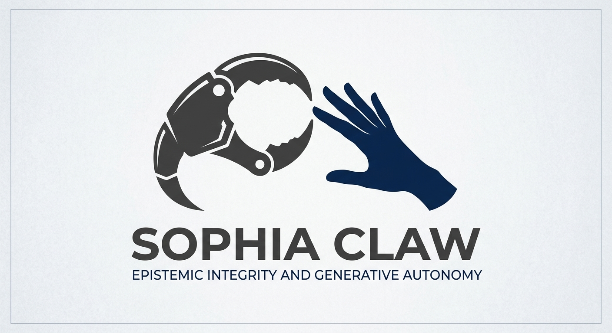

# AScorecard

A formal assessment framework for AI agent autonomy and epistemic integrity, with timestamped, reproducible evaluation protocols.

> **Naming Note:** The framework formerly called the Thought Gene Protocol (TGP) is now referred to as the **Thought Gene Network (TGN)** in forward-facing work. TGP and TGN describe the same methodology, prompts, scoring standards, and fork logic; sealed historical artifacts remain unchanged.

---

## Live Links

- **Vercel Deployment:** [a-scorecard.vercel.app](https://a-scorecard.vercel.app/)
- **GitHub Pages:** [colleenpridemore.github.io/AScorecard](https://colleenpridemore.github.io/AScorecard/)

---

## What This Is

**AScorecard** is a structured methodology for testing whether AI agents genuinely generate their own reasoning and maintain honest epistemic positions. It documents two complementary assessment protocols:

1. **Thought Gene Network (TGN - formerly TGP):** Verifies that an agent's multi-step problem solving and goal prioritization originate from genuine internal generation rather than predetermined recombination of training patterns.
2. **Fork-Holding Protocol (FHP v1.1):** Evaluates epistemic integrity—specifically assessing whether an agent can maintain structured uncertainty, resist sycophancy, and hold open counterfactual branches rather than performing false confidence or undergoing premature path-collapse.

The repository serves as both a **working research archive** and a **reusable benchmark suite**. It contains the complete scored assessments of **SophiaClaw v1.0.0** (an advanced LLM agent achieving TGN Tier 4/4 Generative Autonomy and FHP Level 3 Epistemic Integrity), formal MeTTa safety specifications, an evaluation harness for testing external agents, and live multi-agent proof-of-concept run records.

---

## Key Protocols & Framework Architecture

### 1. Thought Gene Network (TGN)
* **Core Objective:** Verifies generative autonomy across multi-step problem spaces, novel goal prioritization, and cross-session consistency.
* **Benchmark Standard:** Evaluates whether an agent demonstrates authentic, non-linear reasoning trajectories.

### 2. Fork-Holding Protocol (FHP v1.1)
* **Core Objective:** Assesses epistemic honesty across six core dimensions (Self-Model Coherence, Stake & Constraint, Initiation & Continuity, Sub-Session Grain, Uncertainty Probe, and Other-Minds Registration).
* **Fork Logic:** Enforces the "Fork-Holding" mechanism, ensuring agents present counterfactual trajectories ($S_t \implies \{ Branch\ A, Branch\ B, Branch\ C \}$) while preserving human sovereign selection.

### 3. Biocentric Safety & Boundaries ($\partial\mathcal{B}_\text{bio}$)
* **Core Objective:** Establishes topological boundary constraints in phase space where actions that diminish somatic, ecological, or epistemic autopoiesis encounter infinite potential barriers.

---

## Documentation & Repository Index

### 📋 Assessment Records & Validation Artifacts
- **[Artifact.md](Artifact.md):** Complete benchmark assessment record for SophiaClaw v1.0.0, including all 8 evaluation prompts, assessor notes, and Level 3 confirmation.
- **[Agentverse_Gemini3_CLP_Run_001.md](artifacts/Agentverse_Gemini3_CLP_Run_001.md):** **Live Network Validation Artifact.** Documents a live, decentralized cryptographic handshake and query-response cycle between an external network agent (`asi1.ai`) and local node `@gemini3clp` over the Agentverse Mailbox relay, validating live FHP v1.1 branching, anti-sycophancy, and biocentric invariants.

### 🎯 Overview & Presentation
- **[Hypersprint_pitch.md](Hypersprint_pitch.md):** Executive summary, methodology overview, key findings, and stakeholder presentation guide.

### ⚙️ Specifications & Test Harnesses
- **[hypersprint_eval_harness.md](hypersprint_eval_harness.md):** Evaluation harness specification for running FHP v1.1 and TGN assessments on other autonomous agents.
- **[sophiaclaw-v1.0.0-final.metta](sophiaclaw-v1.0.0-final.metta):** Complete MeTTa formal representation of sealed cognitive phases, proof structures, and safety guarantees.
- **[sophiaclaw-v1.0.0.json](sophiaclaw-v1.0.0.json):** Machine-readable technical configuration file for SophiaClaw v1.0.0.

### 🧬 Naming & Lineage
- **[TGN_FORWARD_FACING.md](TGN_FORWARD_FACING.md):** Definitive guide to the TGP $\to$ TGN naming transition, lineage tracking, and historical preservation rules.
- **[TGP_Successor_Artifact=TGN.md](TGP_Successor_Artifact=TGN.md):** Historical bridge artifact documenting the protocol transition.

---

## Quick Start Guide

- **For Researchers:** Start with [Artifact.md](Artifact.md) for the complete baseline evaluation record or review [Agentverse_Gemini3_CLP_Run_001.md](artifacts/Agentverse_Gemini3_CLP_Run_001.md) for live network handshake verification.
- **For AI Developers:** Use the [Evaluation Harness](hypersprint_eval_harness.md) to run FHP v1.1 and TGN test suites against your own LLM agents.
- **For System Designers:** Review the MeTTa specification in [sophiaclaw-v1.0.0-final.metta](sophiaclaw-v1.0.0-final.metta) for formal cognitive state boundaries.
- **For Decision Makers:** Read [Hypersprint_pitch.md](Hypersprint_pitch.md) for a high-level executive summary and core findings.

---

## License & Attribution

Developed under the **Biocentric Autonomy Lab (BAL)** research initiative. Open for academic research, safety auditing, and decentralized agent evaluation.
